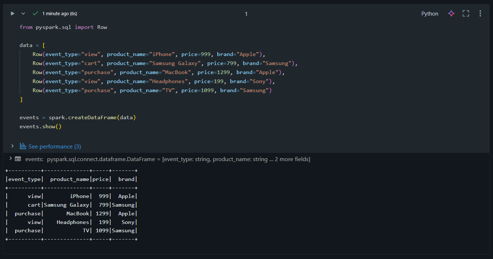
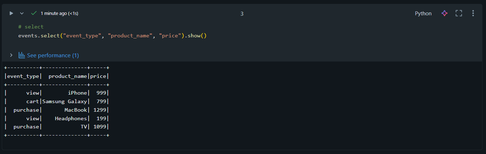
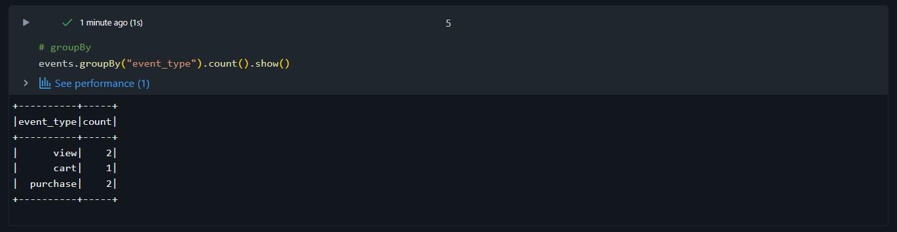

# 📅 Day 02 – Apache Spark Fundamentals (Databricks)

## 🚀 Databricks 14 Days AI Challenge
This repository documents my learning journey for **Day 02** of the  
**Databricks 14 Days AI Challenge** by **Indian Data Club**.

---

## 📌 What I Learned
- Apache Spark architecture (Driver, Executors, DAG)
- Difference between DataFrames and RDDs
- Lazy evaluation in Spark
- Databricks notebook magic commands (`%python`, `%sql`, `%fs`)
- Performing transformations and actions using PySpark

---

## 🛠️ Tasks Completed
✅ Created Day 02 Databricks notebook  
✅ Created sample e-commerce dataset using PySpark  
✅ Loaded data into Spark DataFrame  
✅ Performed basic operations (select, filter, groupBy, orderBy)  
✅ Explored Spark schema and execution behavior  

---

## 🧪 Hands-on Implementation

### 🔹 1. Creating Sample DataFrame (E-commerce Events)


---

### 🔹 2. Selecting Required Columns


---

### 🔹 3. Filtering Data using PySpark


---

### 🔹 4. GroupBy Operation on Event Type


---

### 🔹 5. OrderBy to Find Top Brands


---

### 🔹 6. DataFrame Schema Exploration


---

## 🧠 Key Takeaways
- Spark uses lazy evaluation to optimize performance
- DataFrames are more optimized and user-friendly than RDDs
- `groupBy` and `orderBy` are powerful for analytical queries
- Understanding schema is crucial before transformations

---

## 📂 Repository Structure
```text
Databricks-14-Days-Challenge/
│
├── Day 02/
│   ├── README.md
│   └── screenshots/
│       ├── create_dataframe.png
│       ├── select_operation.png
│       ├── filter_operation.png
│       ├── groupby_operation.png
│       ├── orderby_operation.png
│       └── print_schema.png
│
└── README.md

