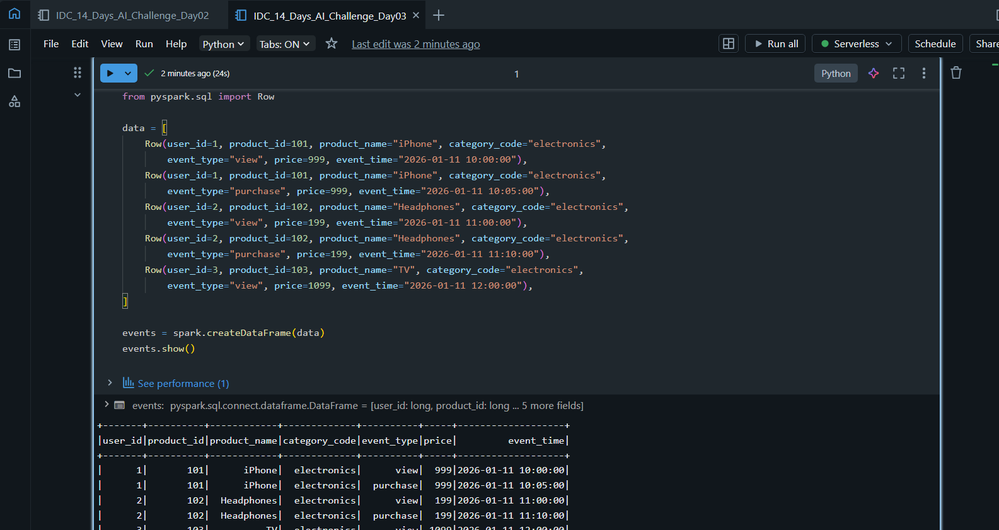
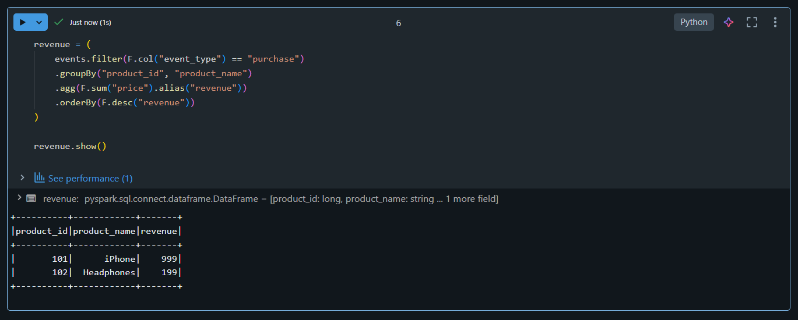
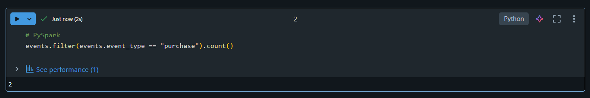
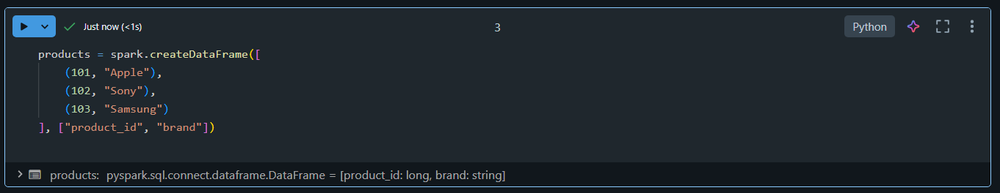
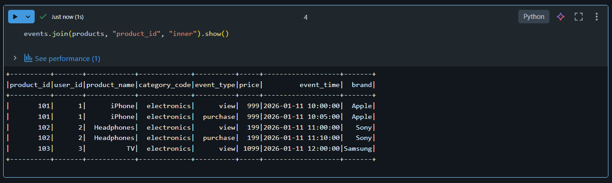
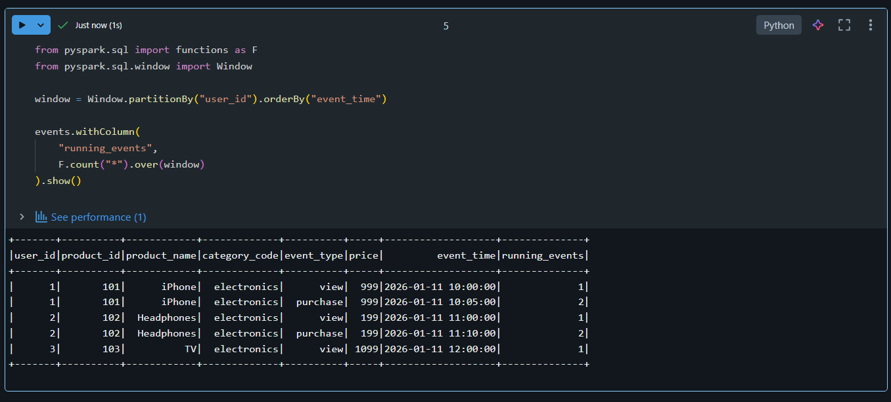
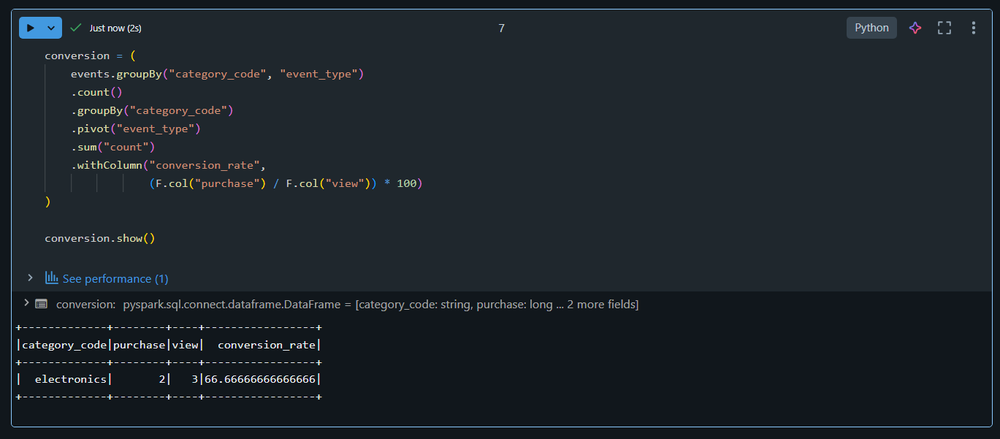
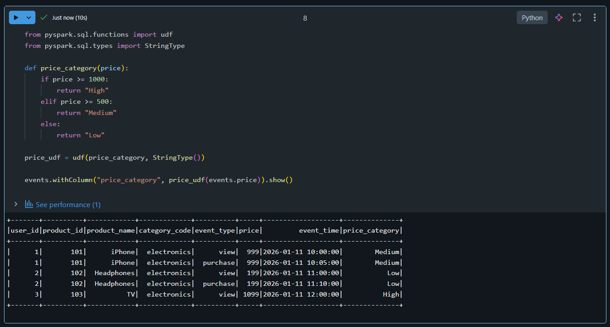

# 🎯 Day 03 – PySpark Transformations Deep Dive

## 🚀 Databricks 14 Days AI Challenge
This document captures my **Day 03** progress in the  
**Databricks 14 Days AI Challenge** by **Indian Data Club**, focusing on **advanced PySpark transformations**.

---

## 📘 What I Learned
- PySpark vs Pandas performance & scalability comparison
- Working with **joins** (inner, left, right, outer)
- **Window functions** for cumulative and ranking operations
- Revenue calculations using aggregations
- Conversion rate analysis
- Creating and using **User-Defined Functions (UDFs)**

---

## 🛠️ Tasks Completed
✅ Loaded full e-commerce dataset  
✅ Performed joins across datasets  
✅ Calculated revenue using aggregations  
✅ Implemented window functions  
✅ Derived conversion metrics  
✅ Built and applied PySpark UDFs  

---

## 🧪 Hands-on Implementation

### 🔹 1. Creating E-commerce DataFrame


---

### 🔹 2. Revenue Calculation (Top Products)


---

### 🔹 3. Filtering Purchase Events


---

### 🔹 4. Joins on Multiple Tables


---

### 🔹 5. Inner Join Implementation


---

### 🔹 6. Window Functions (Running Totals & Ranking)


---

### 🔹 7. Conversion Rate Calculation


---

### 🔹 8. User-Defined Functions (UDFs)


---

## 🧠 Key Takeaways
- PySpark is significantly faster than Pandas for large-scale data
- Window functions are powerful for time-based and ranking analytics
- Joins are critical for real-world data modeling
- Feature engineering is simpler with PySpark transformations
- UDFs extend PySpark beyond built-in functions

---

## 📂 Folder Structure
```text
Day 03/
│
├── README.md
└── Screenshots/
    ├── create_dataframe.png
    ├── revenue_calculation.png
    ├── filter.png
    ├── joins.png
    ├── inner_joins.png
    ├── window_function.png
    ├── conversion_rate.png
    └── udf.png

