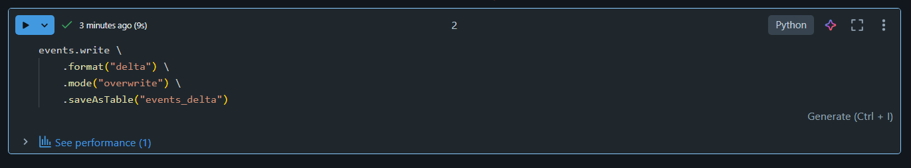
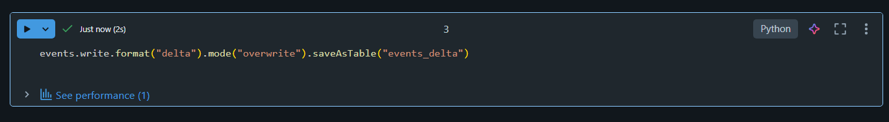
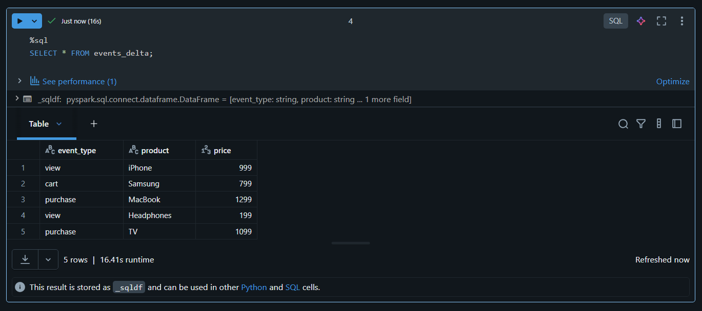
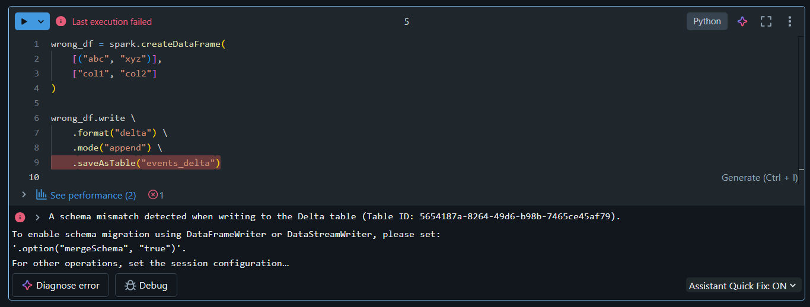
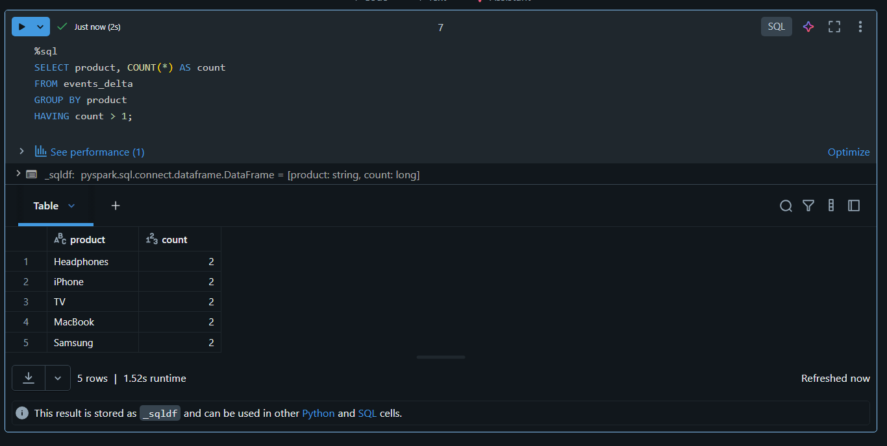
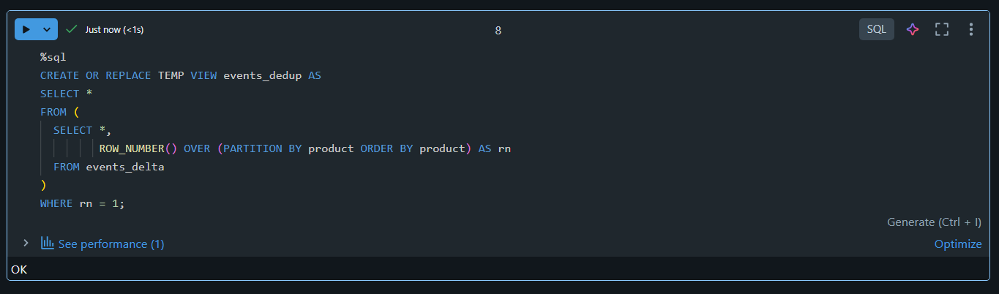
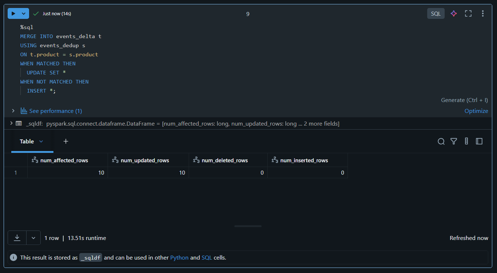
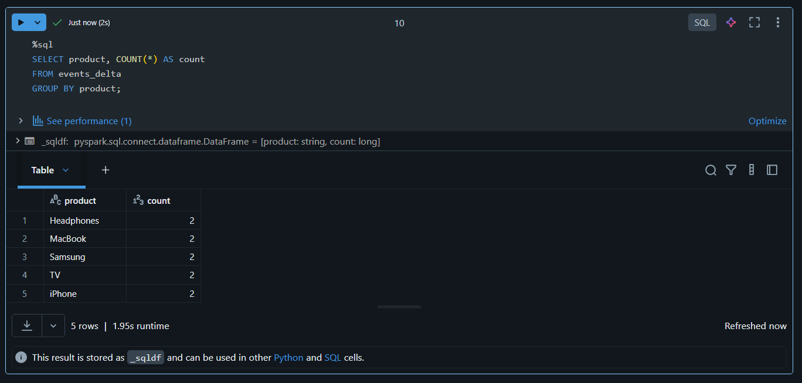

# 📅 Day 04 – Delta Lake Introduction

This day focused on understanding **Delta Lake fundamentals** and implementing core features like **ACID transactions, schema enforcement, and duplicate handling** using both **PySpark and SQL** in Databricks.

---

## 📘 What I Learned

- What is **Delta Lake** and why it is used
- Difference between **Delta vs Parquet**
- Importance of **ACID transactions**
- **Schema enforcement** in Delta tables
- Handling **duplicate records** using MERGE operations

---

## 🛠️ Tasks Completed

### 1️⃣ Convert CSV to Delta Format
Converted the input dataset into **Delta format** using PySpark.

📸 **Screenshot:**  


---

### 2️⃣ Create Delta Tables (PySpark & SQL)

Created a **managed Delta table** using PySpark and verified it using SQL queries.

📸 **Create Delta Table using PySpark:**  


📸 **Verify Delta Table using SQL:**  


---

### 3️⃣ Schema Enforcement Test

Tested Delta Lake’s schema enforcement by trying to append data with an incorrect schema.  
Delta Lake correctly **blocked the write operation**.

📸 **Schema Enforcement Error:**  


---

### 4️⃣ Handle Duplicate Inserts

Handled duplicate records using **deduplication logic** and **MERGE operation**.

#### 🔍 Identify Duplicate Records


#### 🧹 Create Deduplicated Source View


#### 🔁 Merge Deduplicated Data into Delta Table


#### ✅ Final Table Without Duplicates


---

## ✅ Key Takeaways

- Delta Lake provides **ACID guarantees** for big data workloads
- **Schema enforcement** prevents bad data ingestion
- **MERGE + deduplication** is the correct way to handle duplicates
- Delta Lake is reliable, scalable, and production-ready

---

## 📌 Summary

Day 04 helped me understand how Delta Lake improves data reliability and consistency in real-world data engineering pipelines.  
All tasks were successfully implemented and validated using Databricks.

---

📂 **Folder Structure:**

```text
Day 04/
├── README.md
└── Screenshots/
    ├── convert_to_delta.png
    ├── create_delta_table_pyspark.png
    ├── create_delta_table_sql.png
    ├── schema_enforcement_error.png
    ├── duplicate_insert.png
    ├── deduplicated_source_view.png
    ├── merge_after_deduplication.png
    └── final_no_duplicates.png

