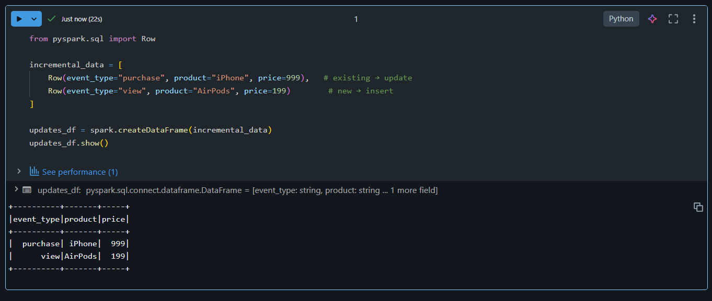
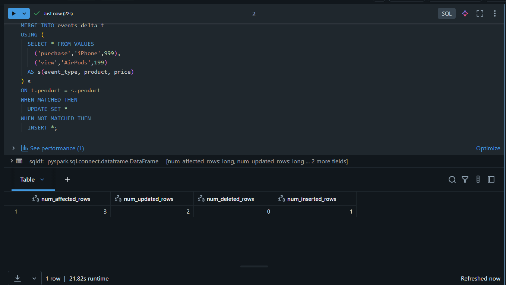
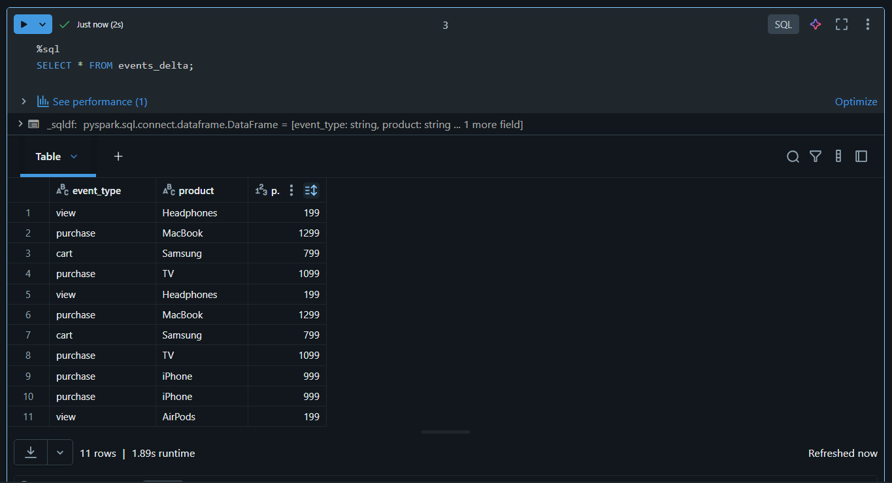
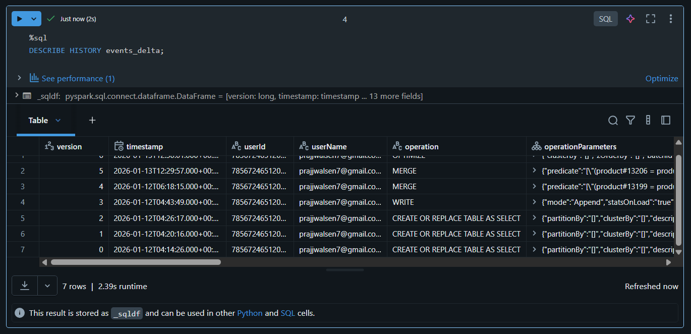
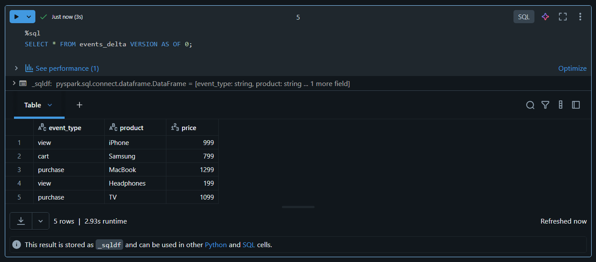
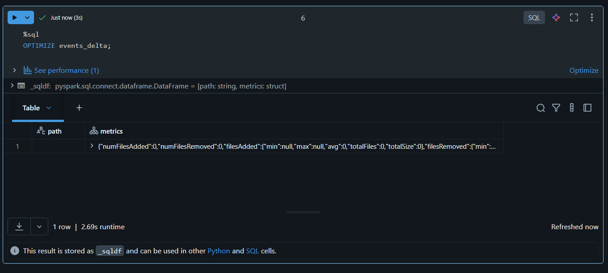
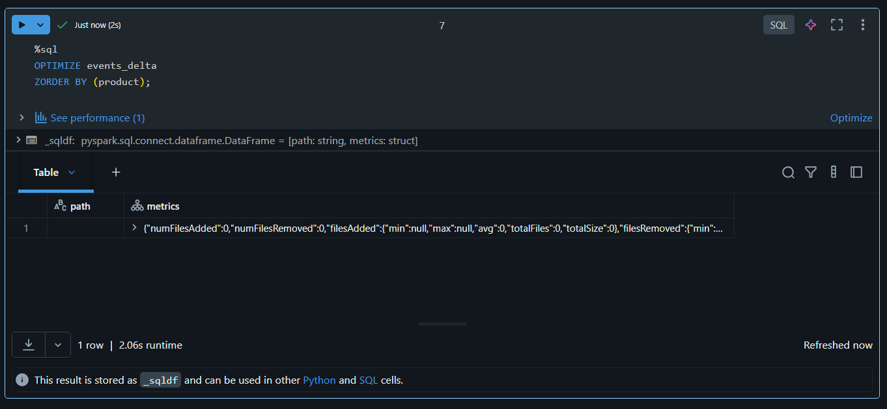

# 🎯 Day 05 – Delta Lake Advanced (Databricks)

## 🚀 Databricks 14 Days AI Challenge  
This document captures my learning and hands-on work for **Day 05** of the  
**Databricks 14 Days AI Challenge** by **Indian Data Club**.

---

## 📌 Topics Covered
- Delta Lake Time Travel (Version History)
- Incremental MERGE (Upserts)
- Querying Historical Versions
- Table Optimization using OPTIMIZE
- Data Skipping with Z-ORDER
- Understanding VACUUM & Retention Policies

---

## 🛠️ Tasks Completed

✅ Implemented incremental MERGE using Delta Lake  
✅ Queried historical versions using Time Travel  
✅ Optimized Delta tables  
✅ Applied Z-ORDER for performance optimization  
⚠️ VACUUM behavior understood (restricted in Community Edition)

---

## 🧪 Hands-on Implementation

### 🔹 1. Incremental Data Ingestion
New incoming data loaded for incremental processing.



---

### 🔹 2. Incremental MERGE (Upsert)
Applied MERGE operation to update existing records and insert new ones.



---

### 🔹 3. MERGE Result Verification
Verified affected rows after MERGE execution.



---

### 🔹 4. Delta Table History
Checked Delta Lake transaction history to track changes.



---

### 🔹 5. Time Travel (Version Querying)
Queried older versions of the Delta table using time travel.



---

### 🔹 6. Table Optimization
Optimized Delta table to improve query performance.



---

### 🔹 7. Z-ORDER Optimization
Applied Z-ORDER on frequently queried columns for efficient data skipping.



---

## ⚠️ VACUUM Note (Important)
VACUUM with retention less than **168 hours** is restricted in  
**Databricks Community / Serverless Edition**.

✔️ The behavior and safety mechanism were observed and understood as part of learning.

---

## 🧠 Key Takeaways
- Delta Lake enables reliable **incremental data processing**
- Time Travel is powerful for auditing and debugging
- OPTIMIZE + Z-ORDER significantly improve query performance
- VACUUM is critical but protected by safety constraints

---

## 📂 Repository Structure
```text
Day-05/
│
├── README.md
└── Screenshots/
    ├── incremental_data.png
    ├── incremental_merge.png
    ├── merge_result.png
    ├── delta_history.png
    ├── time_travel_version.png
    ├── optimize_table.png
    └── zorder_table.png

