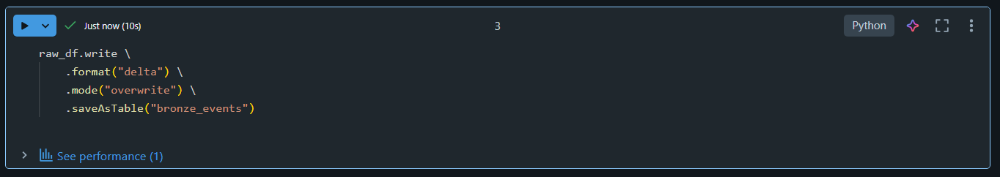
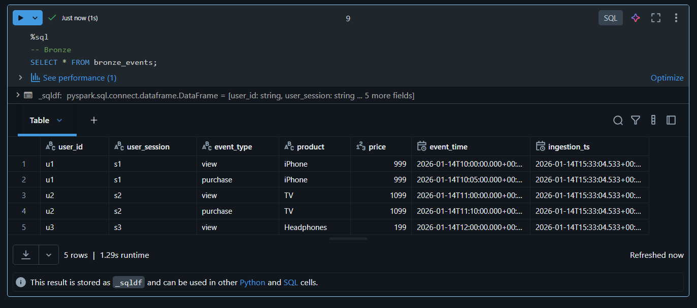
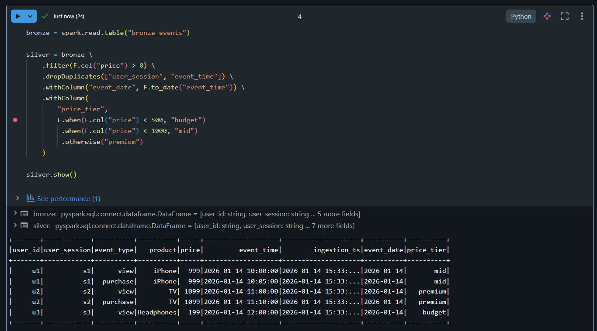
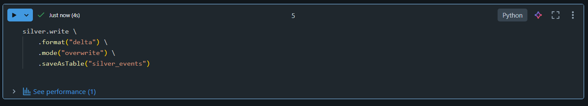
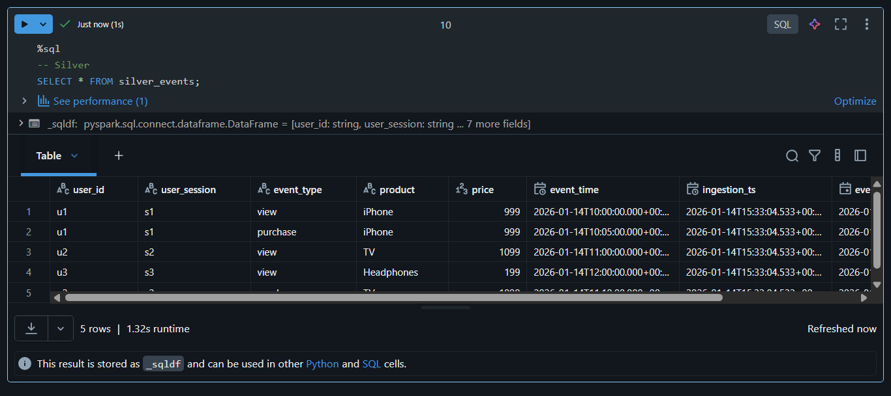
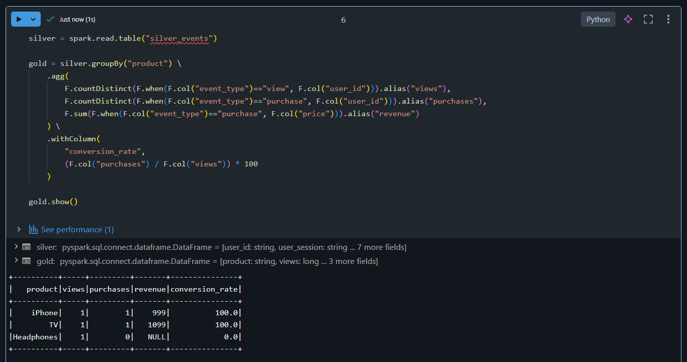
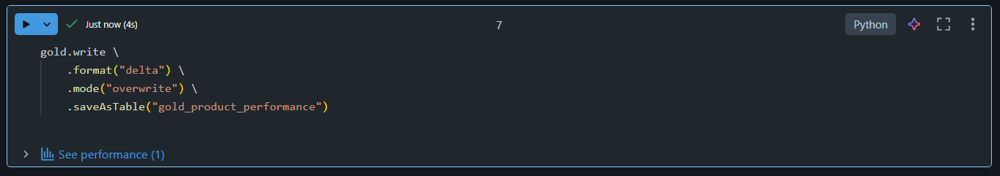
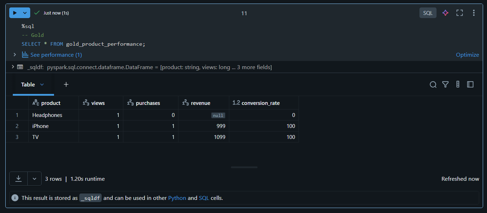

# 🎯 Day 06 – Medallion Architecture (Databricks)

## 🚀 Databricks 14 Days AI Challenge  
This document captures my learning and hands-on work for **Day 06** of the  
**Databricks 14 Days AI Challenge** by **Indian Data Club**.

---

## 📌 Topics Covered
- Medallion Architecture fundamentals
- Bronze → Silver → Gold data layers
- Best practices for each layer
- Incremental data processing patterns
- Business-level aggregations using Delta Lake

---

## 🛠️ Tasks Completed

✅ Designed a 3-layer Medallion Architecture  
✅ Built Bronze layer for raw data ingestion  
✅ Built Silver layer for data cleaning & validation  
✅ Built Gold layer for business aggregates  
✅ Calculated conversion rate and revenue metrics  

---

## 🧪 Hands-on Implementation

### 🔹 1. Bronze Layer – Raw Ingestion
Ingested raw CSV data and stored it as a Delta table with ingestion timestamp.



---

### 🔹 2. Final Bronze Table
Verified raw data stored correctly in the Bronze layer.



---

### 🔹 3. Silver Layer – Cleaned Data
Cleaned and validated data by:
- Removing invalid prices
- Deduplicating records
- Preparing data for analytics



---

### 🔹 4. Price Tier Classification
Created a derived column to categorize products into pricing tiers.



---

### 🔹 5. Final Silver Table
Verified the refined Silver layer data.



---

### 🔹 6. Gold Layer – Business Aggregates
Aggregated Silver data to generate business insights.



---

### 🔹 7. Conversion Rate Calculation
Calculated conversion rate using views and purchases.



---

### 🔹 8. Final Gold Table
Verified analytics-ready Gold table.



---

## 🧠 Key Takeaways
- Medallion Architecture provides a **scalable and structured data pipeline**
- Bronze ensures raw data traceability
- Silver improves data quality and consistency
- Gold delivers **business-ready insights**
- Delta Lake simplifies managing layered architectures

---

## 📂 Repository Structure
```text
Day-06/
│
├── README.md
└── Screenshots/
    ├── Screenshot 2026-01-14 210225.png
    ├── bronze_raw_ingestion.png
    ├── final_bronze_table.png
    ├── silver_cleaned_data.png
    ├── silver_price_tier.png
    ├── final_silver_table.png
    ├── gold_aggregates.png
    ├── conversion_rate.png
    └── final_gold_table.png

