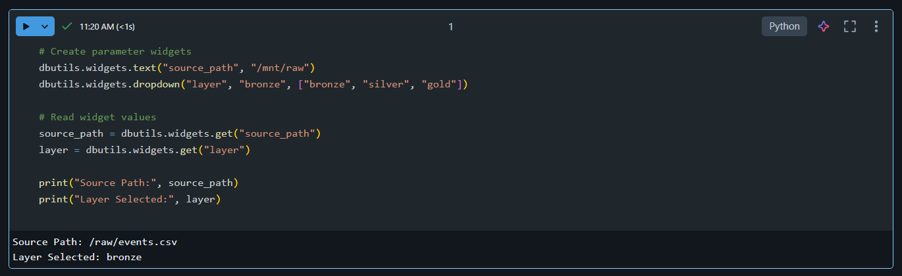
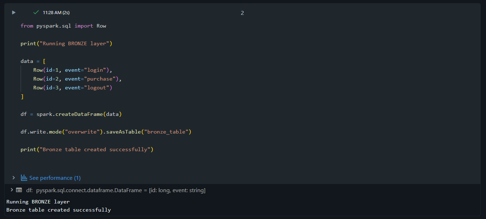
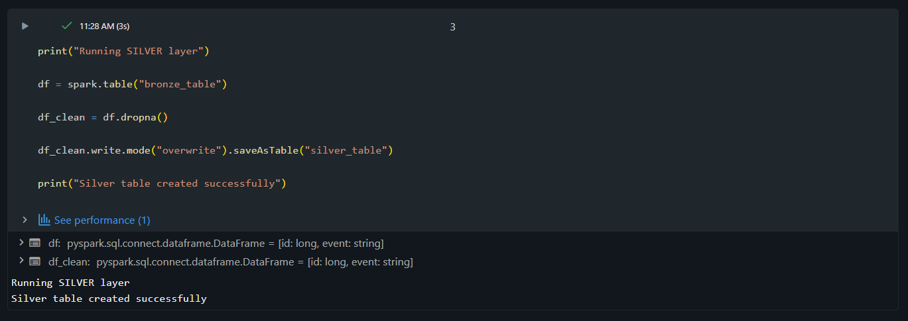
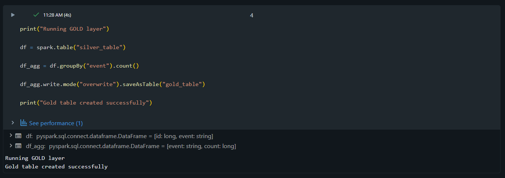
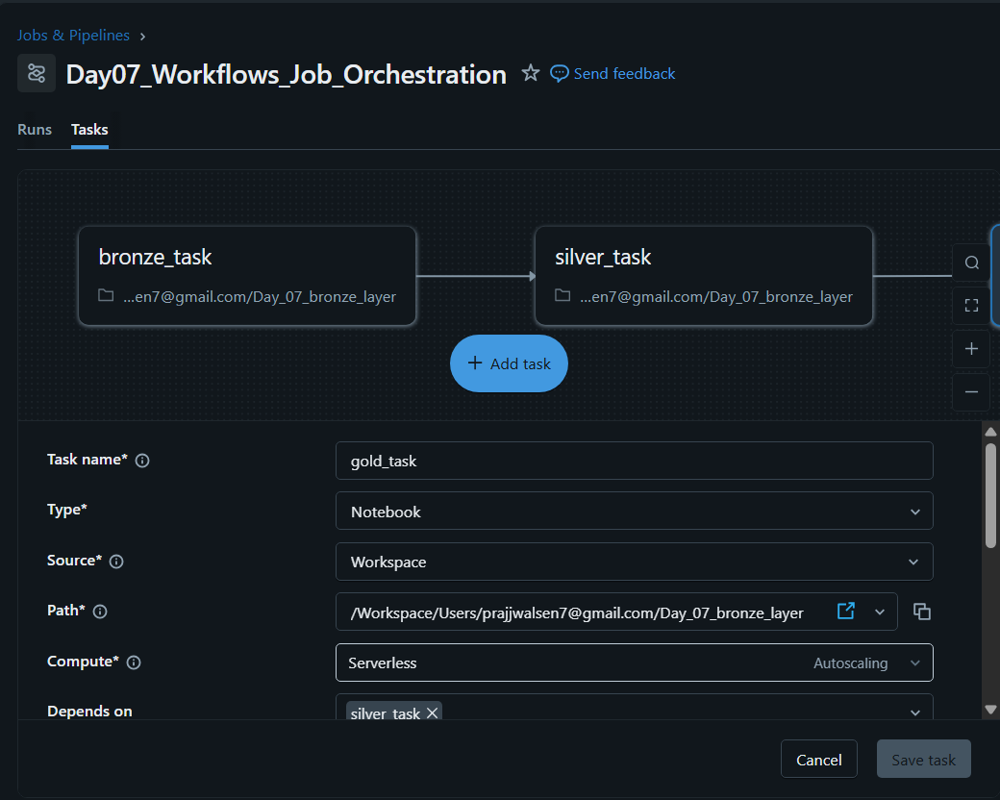
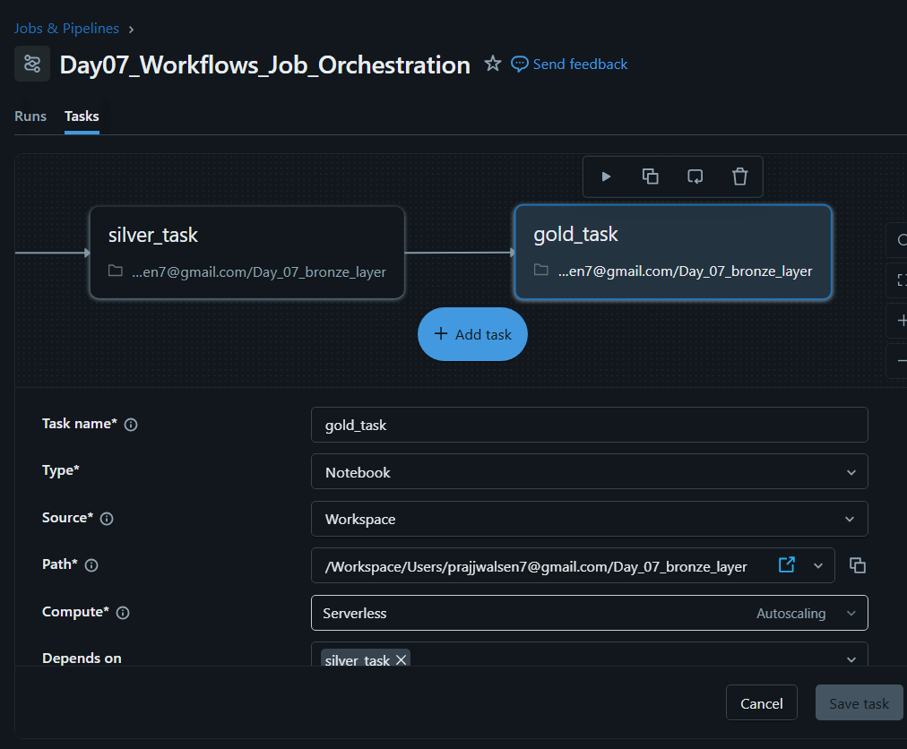

# 🎯 Day 07 – Workflows & Job Orchestration (Databricks)

## 🚀 Databricks 14 Days AI Challenge  
This document captures my learning and hands-on implementation for **Day 07** of the  
**Databricks 14 Days AI Challenge** by **Indian Data Club**.

---

## 📌 Topics Covered
- Databricks **Jobs vs Notebooks**
- Workflow & Job Orchestration
- Multi-task job execution
- Bronze → Silver → Gold pipeline flow
- Task dependencies
- Parameter widgets
- Job scheduling basics
- Error-free sequential execution

---

## 🛠️ Tasks Completed

✅ Added parameter widgets to notebooks  
✅ Implemented Bronze, Silver, and Gold layers  
✅ Executed all layers in correct sequence  
✅ Created Databricks Job Workflow  
✅ Configured task dependencies  
✅ Verified successful orchestration  

---

## 🧪 Hands-on Implementation

### 🔹 1. Parameter Widgets
Created widgets to understand parameterized execution and dynamic control.



---

### 🔹 2. Bronze Layer – Raw Data Creation
Implemented the Bronze layer to create raw event data and store it as a table.



---

### 🔹 3. Silver Layer – Data Cleaning
Processed Bronze data by cleaning and preparing it for analytics.



---

### 🔹 4. Gold Layer – Aggregation
Aggregated Silver data to generate analytics-ready insights.



---

### 🔹 5. Job Workflow – Task Orchestration
Created a Databricks Job to orchestrate the execution flow.



---

### 🔹 6. Workflow with Dependencies
Configured dependencies to ensure sequential execution:  
**Bronze → Silver → Gold**



---

## 🧠 Key Takeaways
- Databricks Jobs enable **automated and repeatable workflows**
- Workflows help manage **task dependencies effectively**
- A single notebook can also be orchestrated via Jobs
- Bronze → Silver → Gold ensures structured data processing
- Job orchestration is essential for **production-grade pipelines**

---

## 📂 Repository Structure
```text
Day-07/
│
├── README.md
└── Screenshots/
    ├── bronze_layer.png
    ├── silver_layer.png
    ├── gold_layer.png
    ├── widgets.png
    ├── job_workflow.png
    └── job_workflow_2.png

