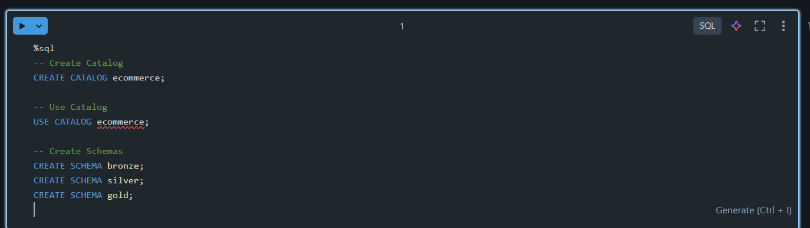
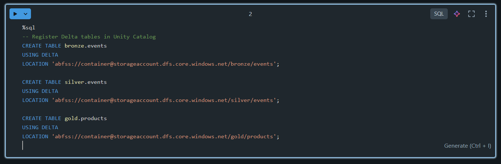
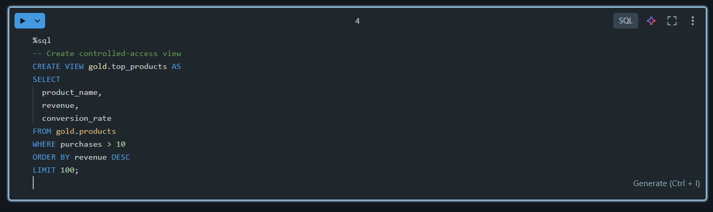

# 🎯 Day 08 – Unity Catalog Governance (Databricks)

## 🚀 Databricks 14 Days AI Challenge  
This document captures my learning and hands-on practice for **Day 08** of the  
**Databricks 14 Days AI Challenge** by **Indian Data Club**, focused on data governance using **Unity Catalog**.

---

## 📘 Topics Covered
- Unity Catalog overview
- Catalog → Schema → Table hierarchy
- Managed vs External Delta tables
- Fine-grained access control (GRANT / REVOKE)
- Controlled data access using Views
- Data governance & lineage concepts

---

## 🛠️ Tasks Covered

✅ Create catalog & schemas  
✅ Register Delta tables  
✅ Set up permissions using GRANT  
✅ Create views for controlled access  

---

## 🧪 Hands-on Practice

### 🔹 1. Create Catalog & Schemas
Created catalog and schemas to understand the **Unity Catalog hierarchy**
(Catalog → Schema → Table).



---

### 🔹 2. Register Delta Tables
Registered Delta tables to demonstrate **managed vs external table concepts**
under Unity Catalog governance.



---

### 🔹 3. Set Up Permissions
Practiced **fine-grained access control** using GRANT statements at schema and
table level.


---

### 🔹 4. Controlled Access Using Views
Created views to expose **secure and controlled data access** for end users.




## ⚠️ Execution Note (Important)

Unity Catalog features were practiced **conceptually using reference SQL**.

Databricks **Community / Serverless Edition** does not support full Unity Catalog
functionality such as:
- Creating catalogs
- Cloud-backed external locations
- GRANT / REVOKE governance features

The focus of this exercise was to understand:
- Unity Catalog hierarchy (Catalog → Schema → Table)
- Governance and access control concepts
- Secure data sharing using views
- Enterprise-grade data governance patterns

These SQL commands are fully compatible with **Unity Catalog–enabled Databricks
workspaces used in production environments**.

---

## 🧠 Key Takeaways
- Unity Catalog provides centralized governance for data platforms
- Enables fine-grained access control across catalogs and schemas
- Improves security, compliance, and auditability
- Views are effective for controlled and secure data access

---

## 📂 Repository Structure
```text
Day-08/
│
├── README.md
└── Screenshots/
    ├── Create_catalog_schemas.png
    ├── Delta_tables.png
    ├── Set_up_permissions.png
    └── Controlled_access.png

