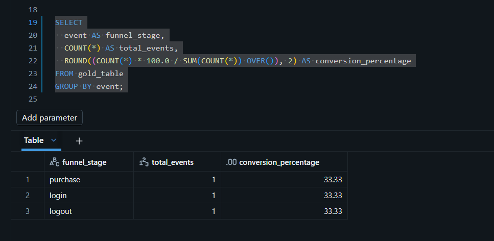
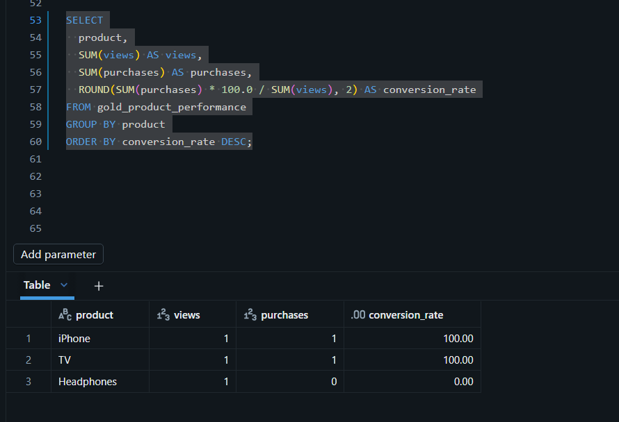
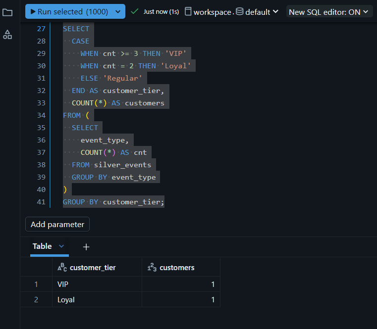
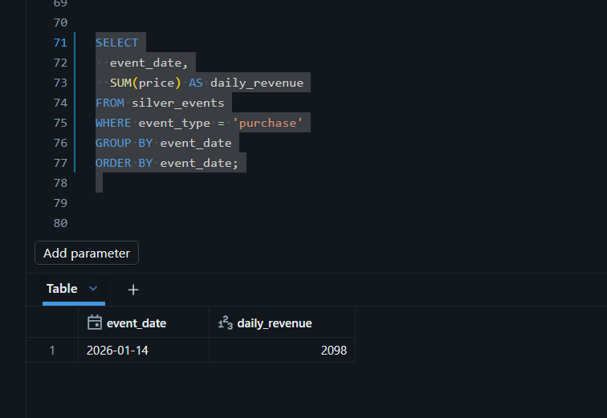
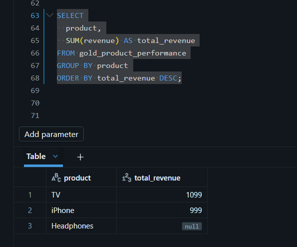
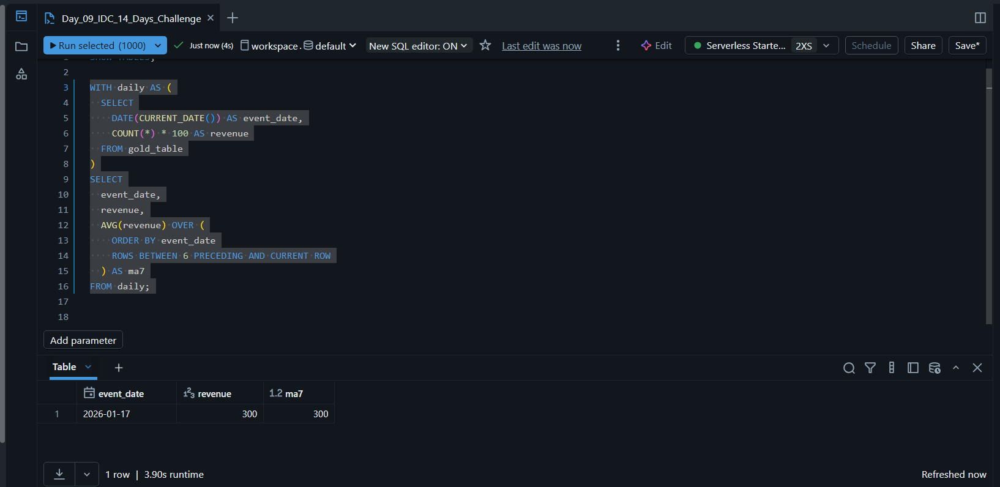
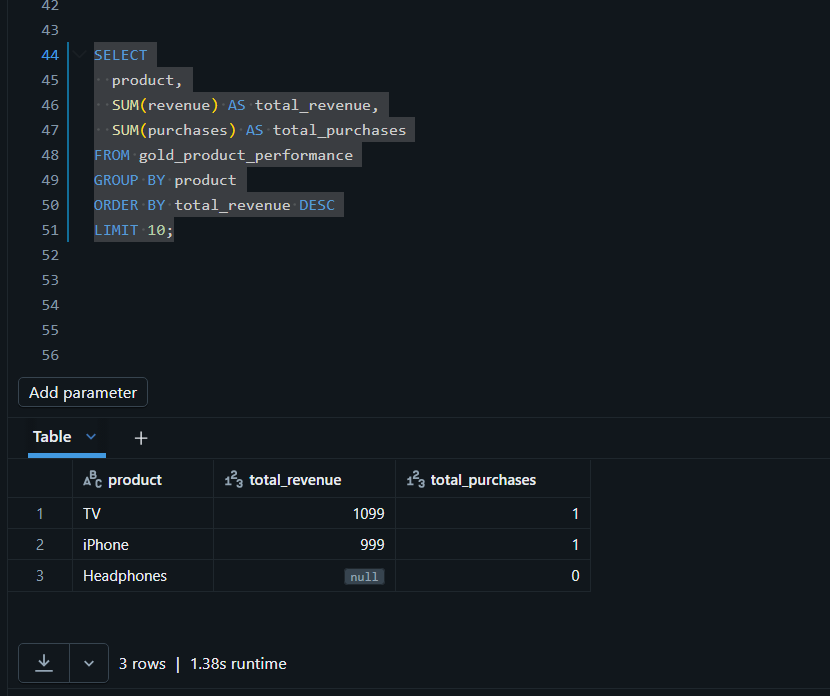

# 🎯 Day 09 – SQL Analytics & Dashboards (Databricks)

## 🚀 Databricks 14 Days AI Challenge  
This document captures my learning and hands-on work for **Day 09** of the  
**Databricks 14 Days AI Challenge** by **Indian Data Club**.

---

## 📌 Topics Covered
- SQL Warehouses in Databricks
- Advanced analytical SQL queries
- Revenue & conversion analysis
- Customer segmentation
- Business-ready analytics preparation

---

## 🛠️ Tasks Completed

✅ Created & used SQL Warehouse (Serverless)  
✅ Wrote complex analytical SQL queries  
✅ Analyzed revenue trends & funnels  
✅ Identified top-performing products  
✅ Segmented customers based on behavior  

> ⚠️ **Note:** Dashboard scheduling & auto-refresh are limited in Databricks Community Edition.

---

## 🧪 Hands-on Implementation

### 🔹 1. Available Tables Verification
Verified all Bronze, Silver, and Gold tables before running analytics.


---

### 🔹 2. Conversion Funnel Analysis
Analyzed views → purchases funnel to calculate conversion percentage.



---

### 🔹 3. Conversion Funnel with Revenue
Extended funnel analysis to include revenue contribution.



---

### 🔹 4. Customer Segmentation
Segmented customers into **VIP, Loyal, and Regular** categories based on activity.



---

### 🔹 5. Daily Revenue Trend
Calculated daily revenue trend for time-based analysis.



---

### 🔹 6. Revenue by Product
Identified revenue contribution of each product.



---

### 🔹 7. 7-Day Moving Average (MA7)
Calculated 7-day moving average to smooth revenue trends.



---

### 🔹 8. Top Products by Revenue
Ranked top-performing products based on total revenue.



---

## 🧠 Key Takeaways
- SQL Warehouses enable scalable analytics in Databricks
- Window functions are powerful for trend analysis
- Funnel & segmentation queries drive business insights
- Community Edition supports analytics but limits scheduling
- Clean SQL design is essential for dashboards

---

## 📂 Repository Structure
```text
Day-09/
│
├── README.md
└── Screenshots/
    ├── show_tables.png
    ├── conversion_funnel.png
    ├── conversion_funnel_revenue.png
    ├── customer_segmentation.png
    ├── daily_revenue_trend.png
    ├── revenue_by_product.png
    ├── revenue_ma7.png
    └── top_products_by_revenue.png

