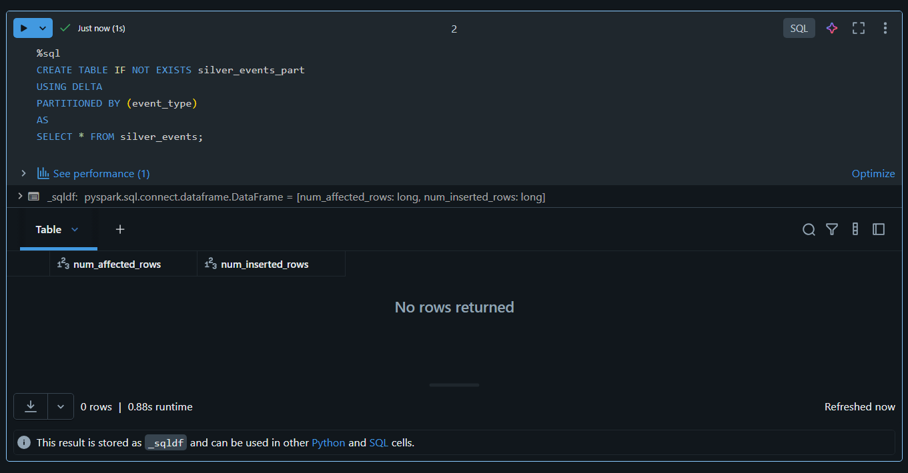
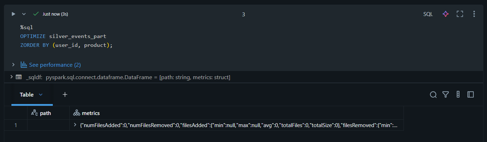
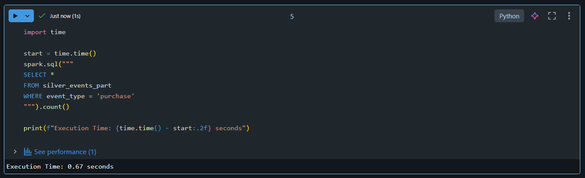
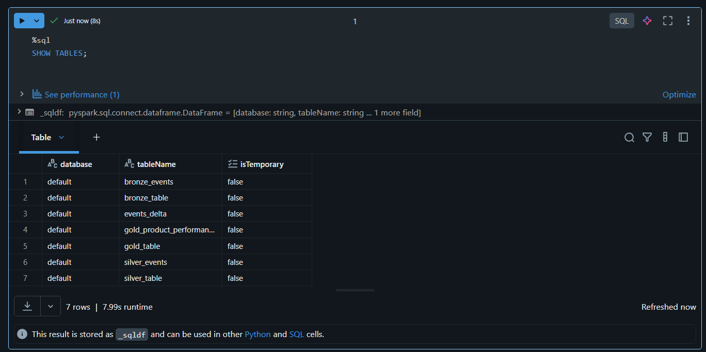
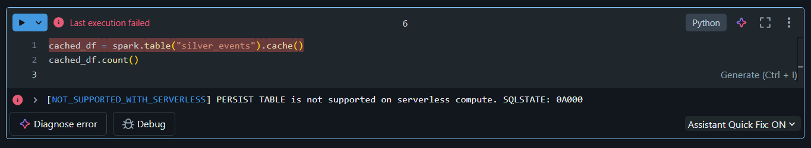

# 🎯 Day 10 – Performance Optimization (Databricks)

## 🚀 Databricks 14 Days AI Challenge  
This document captures my learning and hands-on work for **Day 10** of the  
**Databricks 14 Days AI Challenge** by **Indian Data Club**.

---

## 📌 Topics Covered
- Query execution plans
- Table partitioning strategies
- OPTIMIZE & Z-ORDER
- Query performance benchmarking
- Caching concepts & limitations

---

## 🛠️ Tasks Completed

✅ Analyzed query execution plans  
✅ Created partitioned Delta tables  
✅ Applied OPTIMIZE with Z-ORDER  
✅ Benchmarked query performance  
⚠️ Explored caching limitations on Serverless compute  

---

## 🧪 Hands-on Implementation

### 🔹 1. Query Execution Plan Analysis
Analyzed Spark execution plans to understand how queries are optimized internally.


---

### 🔹 2. Partitioned Delta Table
Created a partitioned version of the Silver table to improve query pruning and performance.



---

### 🔹 3. OPTIMIZE & Z-ORDER
Applied OPTIMIZE with Z-ORDER to reduce file scanning and improve query speed.



---

### 🔹 4. Query Benchmarking
Measured query execution time before and after optimization to validate performance improvements.



---

### 🔹 5. Table Verification
Verified all available tables after optimization steps.



---

### 🔹 6. Cache Table (Limitation Observed)
Attempted to cache a table for iterative query performance improvement.



⚠️ **Note:**  
Caching could not be executed because **Databricks Community Edition uses Serverless Compute**, which does **not support `CACHE` or `PERSIST` operations**.  
This limitation is specific to Serverless environments and requires a dedicated (non-serverless) cluster.

---

## 🧠 Key Takeaways
- Query execution plans help in understanding Spark optimizations
- Partitioning significantly improves query pruning
- OPTIMIZE & Z-ORDER reduce file scanning overhead
- Benchmarking validates real performance gains
- Caching is not supported in Serverless compute (Community Edition)

---

## 📂 Repository Structure
```text
Day-10/
│
├── README.md
└── Screenshots/
    ├── query_execution_plan.png
    ├── partitioned_table.png
    ├── optimize_zorder.png
    ├── benchmark_query_time.png
    ├── show_tables.png
    └── cache_table.png

