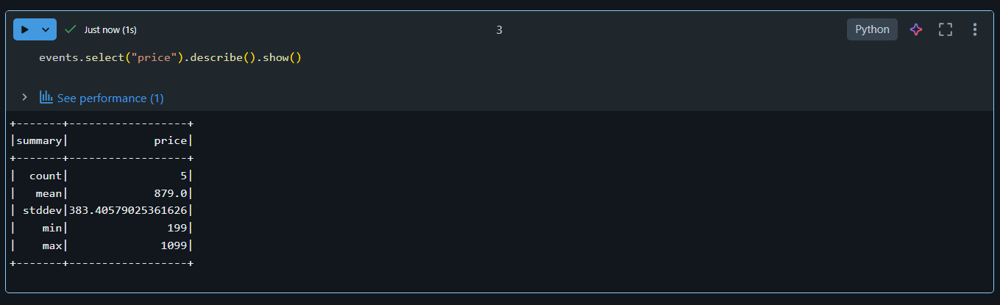
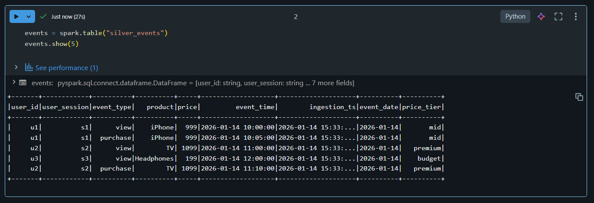
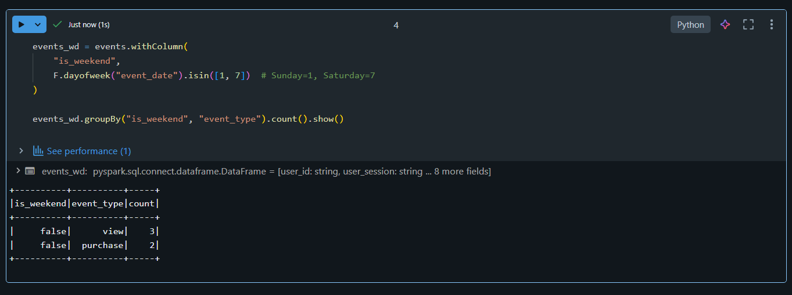
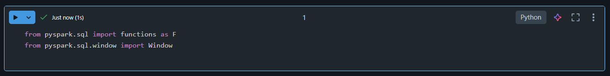
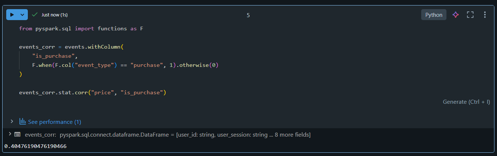
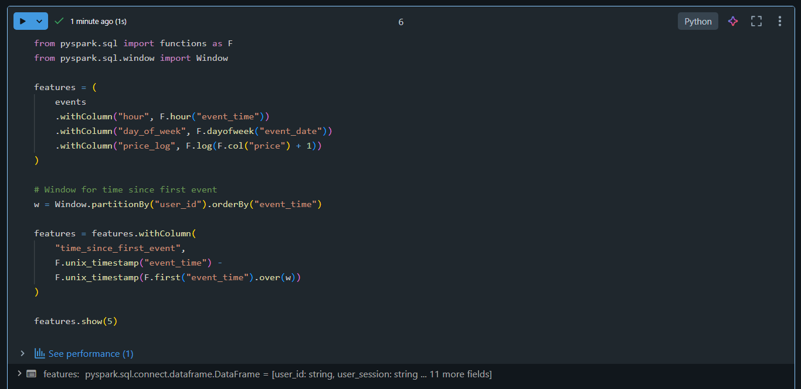
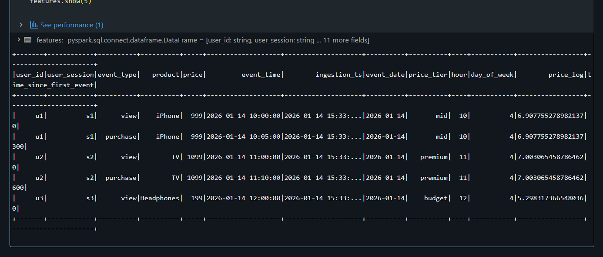

# 🎯 Day 11 – Statistical Analysis & ML Preparation (Databricks)

## 🚀 Databricks 14 Days AI Challenge  
This document captures my learning and hands-on work for **Day 11** of the  
**Databricks 14 Days AI Challenge** by **Indian Data Club**.

---

## 📌 Topics Covered
- Descriptive statistics using Spark
- Hypothesis testing (weekday vs weekend)
- Correlation analysis
- Feature engineering for ML pipelines

---

## 🛠️ Tasks Completed

✅ Calculated statistical summaries  
✅ Performed hypothesis testing (weekday vs weekend behavior)  
✅ Identified correlations between key variables  
✅ Engineered features for ML readiness  

---

## 🧪 Hands-on Implementation

### 🔹 1. Descriptive Statistics
Computed statistical summaries (count, mean, stddev, min, max) for numerical features like price.



---

### 🔹 2. Events Table Verification
Loaded and verified the Silver events table used for analysis.



---

### 🔹 3. Hypothesis Testing (Weekday vs Weekend)
Created a derived column to classify events as weekday or weekend and analyzed user behavior across both.

  


---

### 🔹 4. Correlation Analysis
Analyzed correlation between product price and purchase behavior to understand feature relationships.



---

### 🔹 5. Feature Engineering
Engineered new ML-ready features such as:
- Hour of event  
- Day of week  
- Log-transformed price  
- Time since first user interaction (window functions)



---

### 🔹 6. Feature Engineering Output
Verified transformed features after applying feature engineering logic.



---

## 🧠 Key Takeaways
- Descriptive statistics provide quick insights into data distribution
- Hypothesis testing helps validate behavioral assumptions
- Correlation analysis supports feature selection decisions
- Feature engineering is critical for ML model performance
- Spark window functions enable advanced temporal feature creation

---

## 📂 Repository Structure
```text
Day-11/
│
├── README.md
└── Screenshots/
    ├── descriptive_statistics.png
    ├── show_events_table.png
    ├── weekday_vs_weekend.png
    ├── Screenshot 2026-01-19 091332.png
    ├── correlation_price_vs_purchase.png
    ├── feature_engineering.png
    └── feature_engineering_output.png

