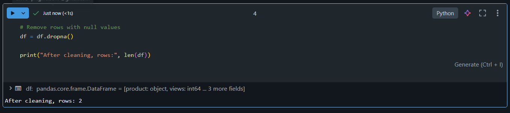
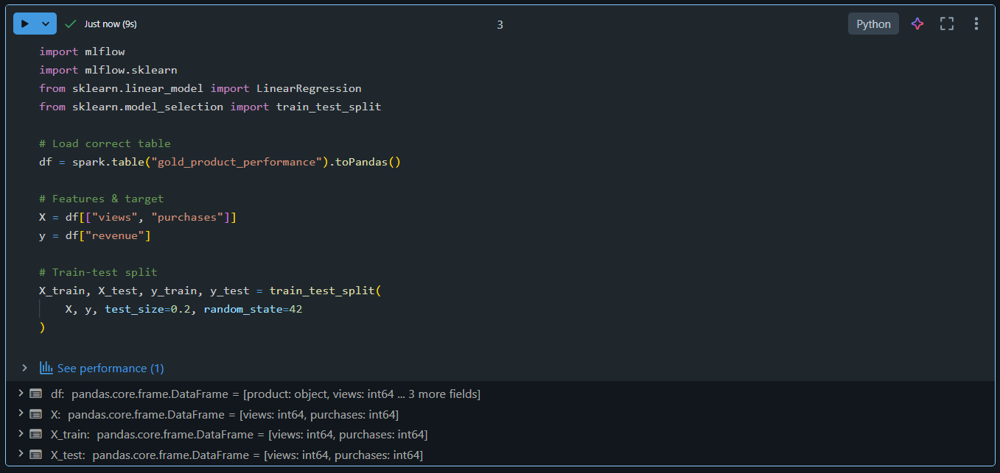
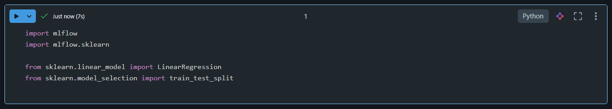

# 🎯 Day 12 – MLflow Basics (Databricks)

## 🚀 Databricks 14 Days AI Challenge  
This document captures my learning and hands-on work for **Day 12** of the  
**Databricks 14 Days AI Challenge** by **Indian Data Club**.

---

## 📌 Topics Covered
- MLflow components (tracking, runs, artifacts)
- Experiment tracking
- Parameter & metric logging
- Model logging with MLflow
- MLflow UI overview

---

## 🛠️ Tasks Completed

✅ Trained a simple regression model  
✅ Logged parameters, metrics, and model  
✅ Viewed experiment runs in MLflow UI  
⚠️ Observed limitations due to small dataset size  

---

## 🧪 Hands-on Implementation

### 🔹 1. Data Cleaning
Cleaned the dataset by removing null values to avoid errors during model training.



---

### 🔹 2. Data Preparation
Prepared features and target variables from the Gold layer table for ML training.



---

### 🔹 3. MLflow & Library Imports
Imported MLflow and required ML libraries to enable experiment tracking.



---

### 🔹 4. Model Training with MLflow Tracking
Trained a **Linear Regression** model and logged:
- Model parameters
- Evaluation metric (R² score)
- Trained model artifact


---

### 🔹 5. MLflow Run Output
Successfully logged the MLflow run and verified it in the MLflow experiment UI.


⚠️ **Note:**  
The R² score appears as **NaN** because the dataset contained **very few records after cleaning**.  
This is an expected behavior and does **not affect MLflow logging or experiment tracking**.

---

## 🧠 Key Takeaways
- MLflow simplifies experiment tracking and reproducibility
- Parameters, metrics, and models can be logged with minimal code
- MLflow UI provides a clear view of experiment runs
- Small datasets may cause evaluation metrics to be undefined, but logging still works correctly

---

## 📂 Repository Structure
```text
Day-12/
│
├── README.md
└── Screenshots/
    ├── data_cleaning.png
    ├── data_preparation.png
    ├── imports_mlflow.png
    ├── Screenshot 2026-01-20 112621.png
    └── Screenshot 2026-01-20 112635.png

