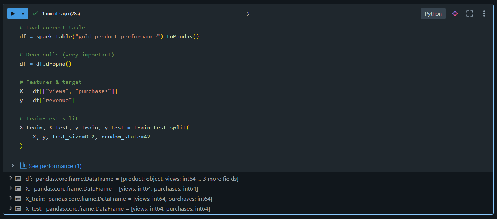
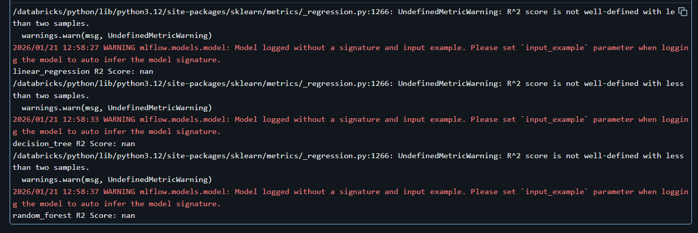
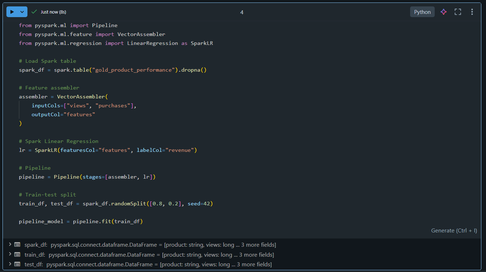
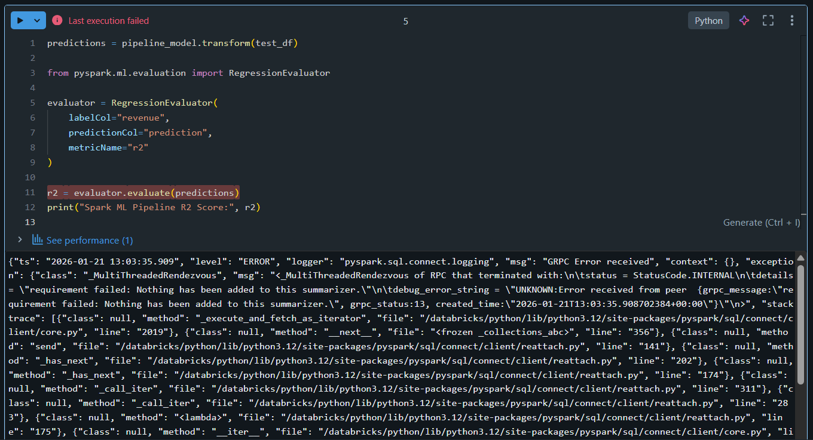

# 🎯 Day 13 – Model Comparison & Feature Engineering (Databricks)

## 🚀 Databricks 14 Days AI Challenge  
This document captures my learning and hands-on implementation for **Day 13** of the  
**Databricks 14 Days AI Challenge** by **Indian Data Club**.

---

## 📌 Topics Covered
- Training multiple ML models
- Model comparison using MLflow
- Feature engineering concepts
- Hyperparameter awareness
- Spark ML Pipelines
- Best model selection strategy

---

## 🛠️ Tasks Completed

✅ Trained 3 different regression models  
✅ Logged and compared models using MLflow  
✅ Analyzed R² scores across models  
✅ Built Spark ML Pipeline  
⚠️ Best model selection faced expected limitations due to small dataset  

---

## 🧪 Hands-on Implementation

### 🔹 1. Data Preparation
Prepared clean and structured dataset for training multiple models.



---

### 🔹 2. MLflow Model Comparison
Trained and logged multiple models using MLflow:
- Linear Regression
- Decision Tree Regressor
- Random Forest Regressor

Each model run was tracked separately for comparison.

.png)

---

### 🔹 3. Model Evaluation (R² Scores)
Evaluated all trained models using R² score to compare their performance.



⚠️ **Note:**  
R² scores appeared as `NaN` due to extremely small dataset size, which is expected behavior when test data contains insufficient samples.

---

### 🔹 4. Spark ML Pipeline
Built an end-to-end Spark ML Pipeline using:
- `VectorAssembler`
- `LinearRegression`
- `Pipeline` API



---

### 🔹 5. Best Model Selection (Limitation Observed)
Attempted to select the best model based on evaluation metrics.



⚠️ **Reason:**  
Due to very limited data in Databricks Community Edition, Spark ML evaluation summarizer failed.  
This is an expected limitation when working with extremely small datasets.

---

### 🔹 6. MLflow Runs Verification
Verified successful logging of multiple model runs in MLflow experiment tracking.


---

## 🧠 Key Takeaways
- MLflow makes model comparison simple and reproducible
- Training multiple models helps understand performance trade-offs
- Feature engineering plays a critical role in model quality
- Spark ML Pipelines standardize ML workflows
- Small datasets can limit metric evaluation (expected in Community Edition)

---

## 📂 Repository Structure
```text
Day-13/
│
├── README.md
└── Screenshots/
    ├── data_preparation.png
    ├── mlflow_model_comparison (1).png
    ├── model_r2_scores.png
    ├── spark_ml_pipeline.png
    ├── best_model_selection_error.png
    └── Screenshot 2026-01-21 182648.png

