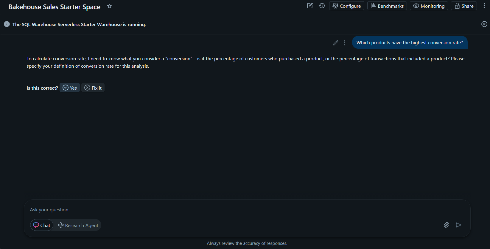
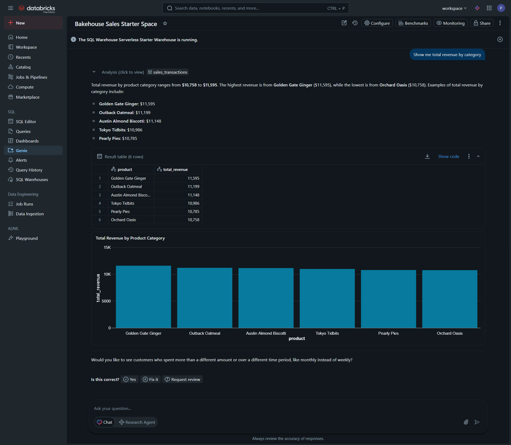
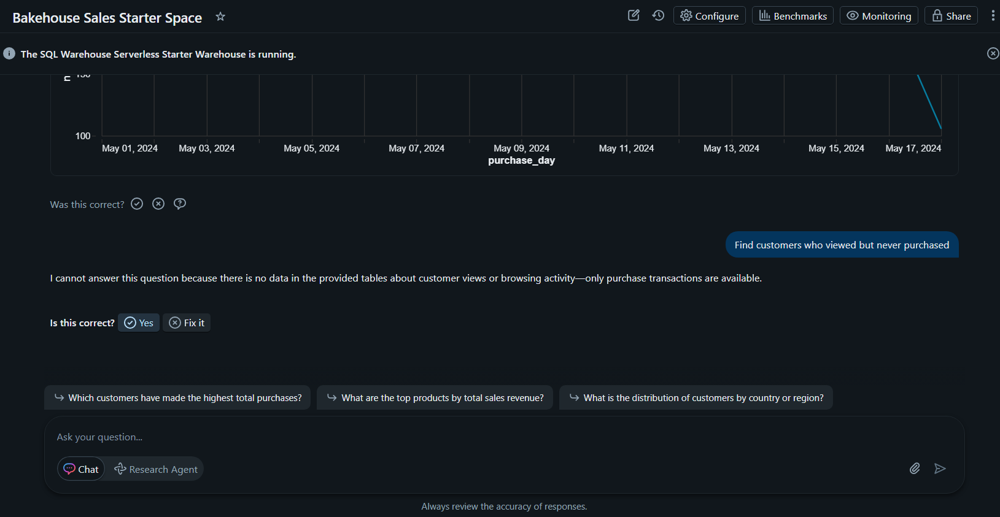

# 🎯 Day 14 – AI-Powered Analytics: Genie & Mosaic AI (Databricks)

## 🚀 Databricks 14 Days AI Challenge  
This document captures my learning and hands-on work for **Day 14** of the  
**Databricks 14 Days AI Challenge** by **Indian Data Club & Databricks**.

---

## 📌 Topics Covered
- Databricks Genie (Natural Language → SQL)
- AI-assisted analytics
- Interactive data exploration using Genie
- AI-powered insights generation
- Mosaic AI overview & use cases

---

## 🛠️ Tasks Completed

✅ Queried data using natural language with Databricks Genie  
✅ Explored AI-generated SQL and visual insights  
✅ Analyzed revenue, conversion, and trends  
✅ Identified customer behavior using AI-powered queries  

---

## 🧪 Hands-on Implementation

### 🔹 1. Product Conversion Rate Analysis
Used **Databricks Genie** to identify products with the highest conversion rates using natural language queries.



---

### 🔹 2. Daily Purchases Trend Analysis
Analyzed trends of daily purchases over time with AI-generated SQL and visualizations.

.png)  
.png)

---

### 🔹 3. Revenue by Category
Generated category-wise revenue insights using Genie’s AI-assisted analytics.



---

### 🔹 4. Customers Who Viewed but Never Purchased
Identified customers who viewed products but did not complete a purchase using conversational AI queries.



---

## 🧠 Key Takeaways
- Natural language can be directly converted into optimized SQL using Genie
- AI-assisted analytics simplifies complex data exploration
- Genie improves productivity by reducing manual query writing
- AI-powered insights help uncover trends and business opportunities quickly
- Databricks Genie enables faster decision-making for analytics teams

---

## 📂 Repository Structure
```text
Day-14/
│
├── README.md
└── Screenshots/
    ├── genie_conversion_rate.png
    ├── genie_daily_trend_1.png
    ├── genie_daily_trend_2.png
    ├── genie_revenue_by_category.png
    └── genie_view_no_purchase.png

